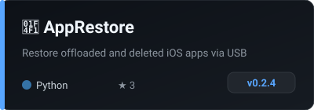
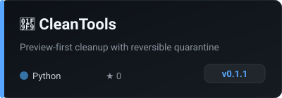
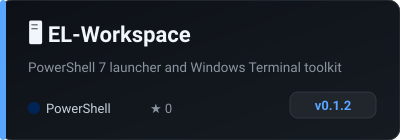

  

 

### Обо мне

Выпускник · Москва · пост-продакшн

- 🛡️ **Информационная безопасность** · РТУ МИРЭА
- 🌐 **Веб-разработка** · НИТУ МИСИС

Делаю открытые утилиты для macOS и Windows.  
*Building practical tools for macOS and Windows.*

---

### Проекты

  
  
  

  
  
  

---

### Стек

  
  
  
  
  

---

  🎧 пост-продакшн · открытый код на <a href="https://github.com/J3ckJ">GitHub</a>

